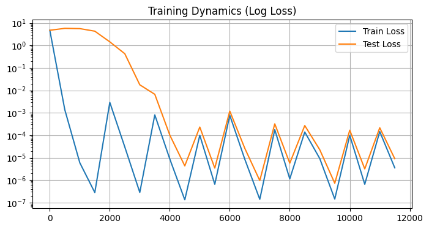
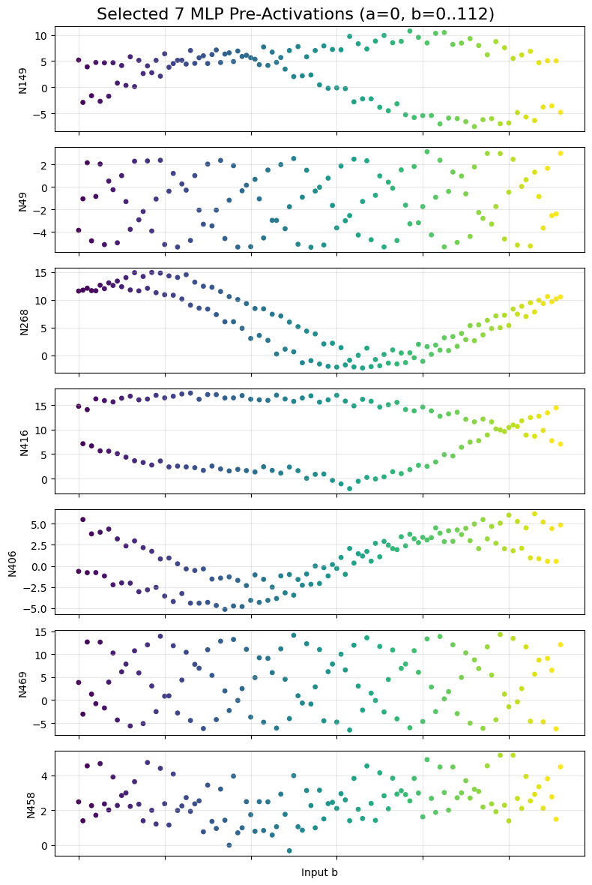
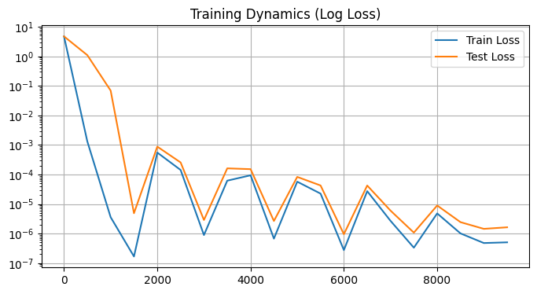

# Reproduce the Grokking moment of LLM
This project reproduces the **"Grokking"** phenomenon in small transformers trained on the modular addition task ($a + b \pmod p$). Using PyTorch, it demonstrates how a model transitions from memorization to generalization, revealing the emergence of periodic (trigonometric) structures within its internal representations.

Grokking is a phenomenon where a model fits the training data perfectly (low training loss) but fails to generalize (high test loss) for a long period, before suddenly "grokking" the solution and achieving near-perfect test accuracy.

### Custom Transformer Architecture
Simplified implementation (removed LayerNorm, manual initialization) designed to facilitate the Grokking phase transition.

### Training Loop
Implements high weight decay regularization to force the model away from memorization and toward the "simpler" periodic solution.

### Visualization
The project generates three main types of plots to interpret the model's learning:
1. Grokking Curves: Plots Training vs. Testing loss/accuracy over 10k+ epochs. Demonstrates the "jagged" struggle during the memorization phase and the smooth drop during the grokking phase.

2. MLP Activity (Pre-ReLU): Visualizes the pre-activation outputs of MLP neurons to reveal sine/cosine wave patterns. Vertical scatter plots showing how specific neurons activate periodically across the input space $b$.

3. Neuron Correlations: A grid of pairwise scatter plots showing circular/elliptical relationships between neurons, demonstrating rotational representations.

4. Embedding Analysis: Frequency analysis of the learned embedding weights.

### Source
Link: https://youtu.be/D8GOeCFFby4?si=-OmGfudmRexcHa-d
OpenAI team’s grokking paper: https://arxiv.org/pdf/2201.02177.

